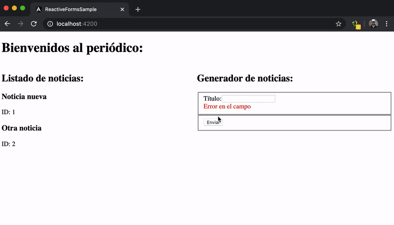

# Angular Sesion 3 - Ejercicios

Vamos a crear un periódico! Pero sencillo :)

En este ejercicio te entregaremos la estructura inicial, recuerda hacer `npm install` después de clonarte el repositorio:

Como puedes observar, el proyecto está compuesto de 3 componentes:

### **newspaper**

Componente que va a orquestar nuestra aplicación, contendrá el listado de noticias y gestionará los eventos y las variables a pasar al resto de componentes.

Verás que este componente define una interfaz muy básica para las noticias, debes completarla añadiendo al menos los siguientes campos:

- Autor
- URL de la imagen principal
- Cuerpo de la noticia (texto)

Puedes añadir más campos si quieres :)

### **news-generator**

Este componente nos servirá para crear nuevas noticias. Contiene la estructura básica de un formulario con unas validaciones y controles mínimos. 

El componente nos permitirá crear noticias nuevas y se las enviará al padre mediante un evento (Output).

Termina el componente añadiendo al formulario todos los campos necesarios para las noticias, y añadiendo validaciones y mensajes de error para todos los campos. Intenta que sean lo más descriptivos posibles.

Te dejamos un listado de validaciones mínimas:

- Autor: Obligatorio, máximo 20 letras
- URL Imagen: Obligatorio, máximo 100 letras
- Cuerpo de la noticia: Obligatorio, máximo 1000 letras, mínimo 50

### **news-viewer**

Este componente nos servirá para visualizar las noticias que recibirá desde su padre mediante un Output. En principio será un componente de mera visualización, añade todos los campos nuevos para que se vea algo mejor :)

No olvides la imagen!

Completa la aplicación para que sea un periódico un poco más potente, suerte!

### BONUS

1) Permite el borrado de noticias: Para ello el componente news-viewer tendrá un botón borrar, que deberá emitir un Output para indicar a su padre (newspaper) que quiere borrar la Noticia, y este realizará el borrado. En el Output deberás emitir al menos el ID de la noticia.

2) Permite la edición de noticias. Para ello el componente news-viewer tendrá un botón editar, que deberá emitir un Output al padre (newspaper) para indicarle que quiere editar una noticia (tendrá que indicarle al menos el ID). El componente newspaper pasará la noticia a editar al componente news-generator mediante un Input() para que este lo muestre y pueda ser editado.
En el momento del guardado, el componente emitirá a su padre la noticia modificada.

3) Utiliza un validador basado en expresiones regulares, que compruebe que la ruta de la imagen es correcta. Debería empezar por https:// o http://, y acabar con .png o .jpeg o .gif

4) Añade un campo más a las noticias "Tipo" que muestre un selector con distintos tipos (política, deporte, economía, salud...).

5) Muestra un par de botones en el visualizador de noticias para ordenar por orden alfabético según el Autor, en orden creciente o decreciente.

6) Habrás notado que si refrescas la web pierdes todas las noticias, para que esto no suceda debes guardarlas en algún sitio que sea persistente. Por ejemplo puedes usar el localstorage, de manera que no pierdas las noticias, y al abrir vuelvas a tenerlas disponibles.